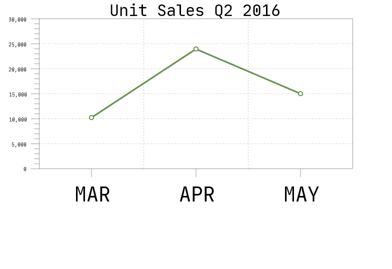
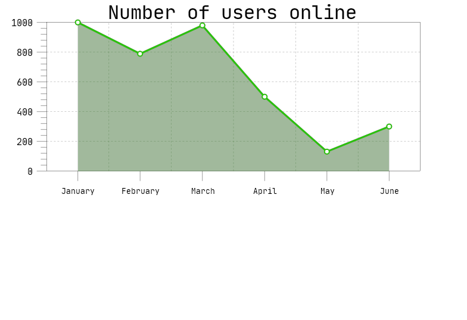
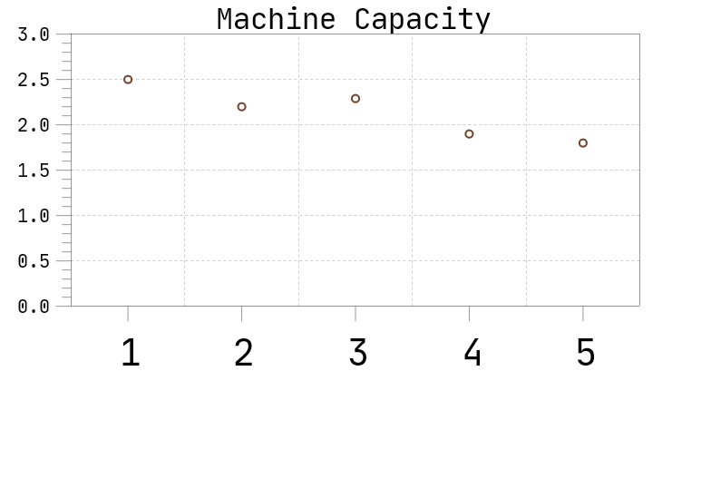
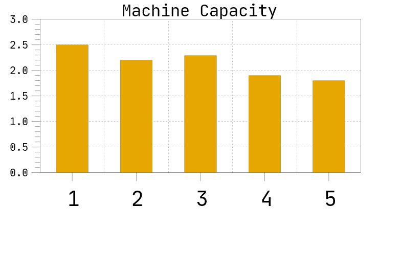
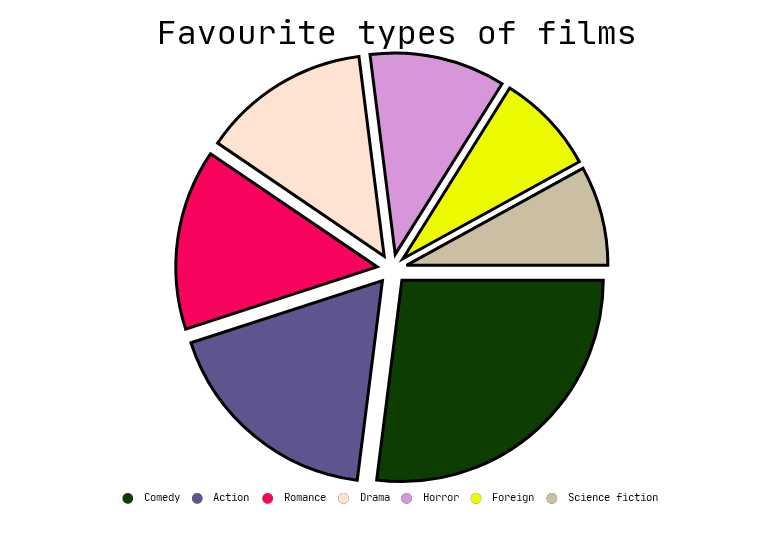
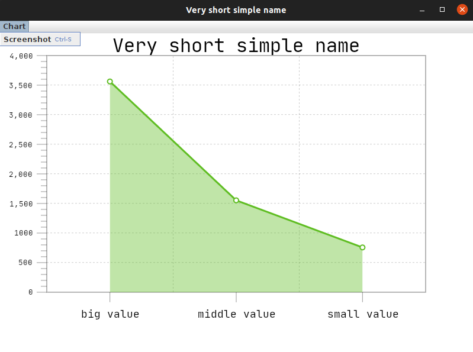
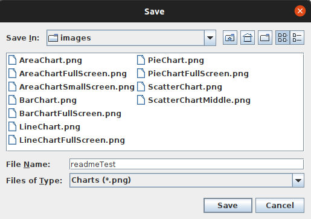
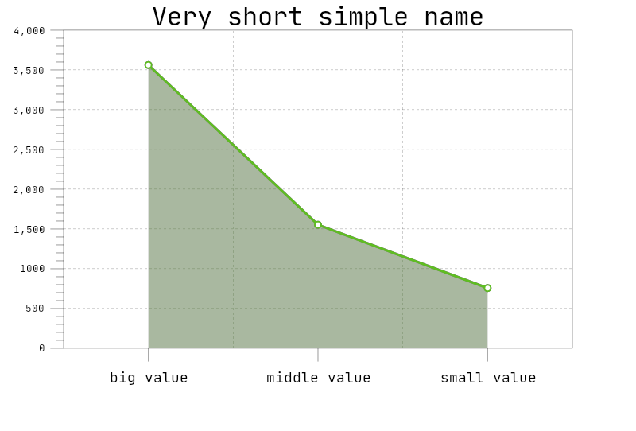

#User guide

##Using

###For Windows:
```#batch
chartDrawer [FILE]
```

###For Linux/MacOS:


```#bash 
./chartDrawer [FILE]
```

For example ```./chartDrawer src/test/files/BigTest.txt``` run chart drawer reading
commands from ```BigTest.txt```.<br>
If you run ```./chartDrawer``` without any parameters, shell will run in interactive mode (read below).

---

## Description

The **chartDrawer** utility allows you to view different charts of your data.

###Interactive mode
If ```FILE``` is not specified, then **shell** starts a loop, in which it reads commands from the standard input and executes them.
You can interact with **shell**, which waits user commands after ``command: ``. All commands have 
the following type:
```
draw [chart type]
```
Read about `chart type` parameter below. Then **shell** waits name of chart after `name:` and starting read user data for chart after `data:`. 
Data must by the following type: `label->value`, where `label` is string and `value` is float number.
Reading data terminates after `ctrl+c` or empty line.

After that utility creates the window with chart of `area` type, with `Very short simple name` name, including points from data.
If you want to save screenshot of chart, click on `Chart->Screenshot` in the top of the window.

**shell** continues read your commands, so you can draw several charts at once.
The program terminates when the `quit` command is given, or end-of-file is detected on its standard input.

Commands can also be specified in the `FILE`. In this case, commands will be interpreted
without attempting to read more commands from the standard input.

---
### Types of charts

+ Line chart

For each item of data(label, value) maps label to value, where labels are situated on x-axis, 
values are situated on y-axis and connects neighbouring points of data with segments.
For example:

+ Area chart

Represents the same data as line chart, but also paint area below chart, like this:

+ Scatter chart

Show you only points of data like circles at coordinate plane:

+ Bar chart

Represents data with rectangular bars with heights proportional to the values:


+ Pie chart

For each label show slice of pie proportional fraction of the total sum:

---
Examples
--
So, example of correct input for utility:
```
command: draw area
name: Very short simple name
data: big value->3562
data: middle value->1553
data: small value->757
data:
```

or in `FILE` it would be:
```
draw area
Very short simple name
big value->3562
middle value->1553
small value->757
```

After entering the input (or using it from file) utility open window:


If you want to save screenshot, click on menu on the top or press ``ctrl+s`` and choose window will be opened:


After saving `readmeTest.png` will be like this:

---
Testing
---
You can find module tests in ```src/test/kotlin``` for some functions.

And there are test files in ```src/test/files``` to check the whole program. 
For example, you can
try ```./chartDrawer src/test/files/PieChartTest2.txt```.

Some of resulting charts you can see at `images/`.